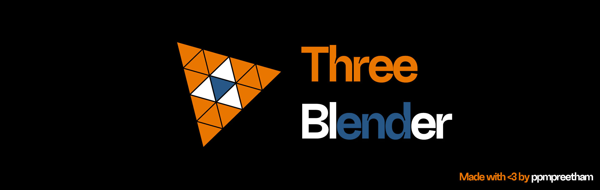

# Three Blender

Write Zero lines of ThreeJS! Now compile your Blender scenes automatically into ThreeJS websites! 

Built with 💖 by [Preetham Pemmasani](https://github.com/ppmpreetham)

<video controls src="three-blender/v01.mp4" title="Three Blender Usage"></video>

## Installation

- Download the [`three_blender_v0.1.py`](https://github.com/ppmpreetham/three-blender/releases/download/v0.1/three_blender_v01.py) file from the [releases](https://github.com/ppmpreetham/three-blender/releases) section
- Open Blender and navigate to `Edit > Preferences > Add-ons > Install`
- Select the downloaded zip file
- Enable the addon by checking the box next to `Import-Export: Three.js Scene Exporter`

##  Usage Instructions

- Create and set up your scene in Blender
- Navigate to Output Properties panel
- Find the `Three.js Export` section
- Enter a path where your HTML file should be saved
- Click `Export Scene` button
- Get the generated HTML file!

## What's Next?
- [ ] Add support for HDRi (by converting it to cubemaps)
- [ ] Support for more lights (Area light and Sun)
- [ ] Support for keyframes
- [ ] Apply modifier before exporting the model.
- [ ] Draco GLB compression
- [ ] Support for Volumetrics

## Contributing
1. Fork the repository.
2. Clone the repository.
3. Create a new branch.
4. Make changes and commit them.
5. Push the changes to your fork.
6. Create a pull request.
7. Make sure to follow the code of conduct.